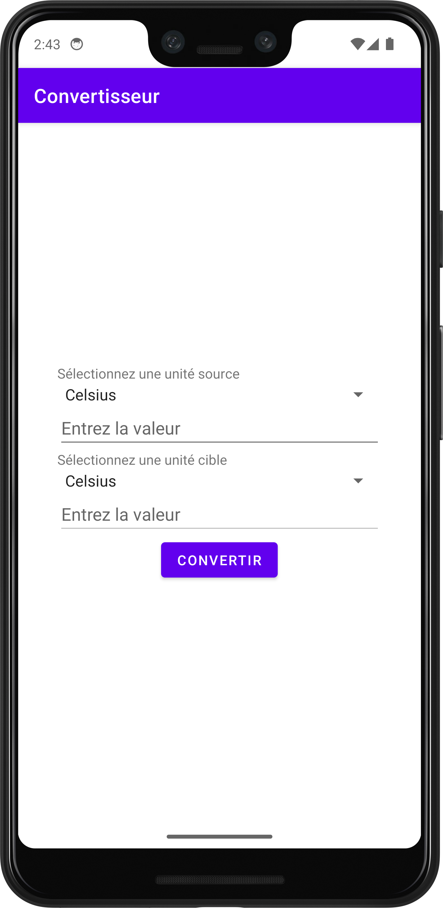
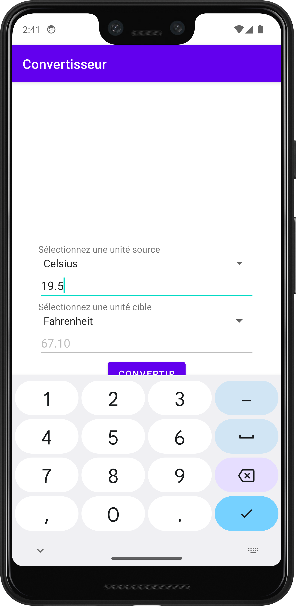
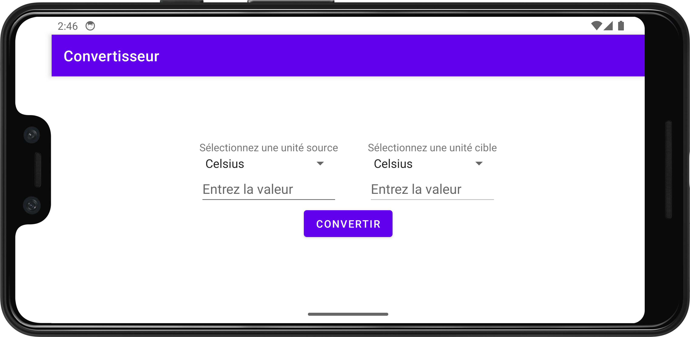

<h1 align="center">Welcome to Android Temperature Converter 👋</h1>

  
  

> Android application to convert temperature units

  
  
  

## Author

👤 **LucasVbr**

* Website: https://lucasvbr.dev
* Github: [@LucasVbr](https://github.com/LucasVbr)
* LinkedIn: [@lucasvbr](https://linkedin.com/in/lucasvbr)

## Show your support

Give a ⭐️ if this project helped you!

## 📝 License

Copyright © 2024 [Lucàs Vabre](https://github.com/LucasVbr). 
This project is [MIT](./LICENSE) licensed.